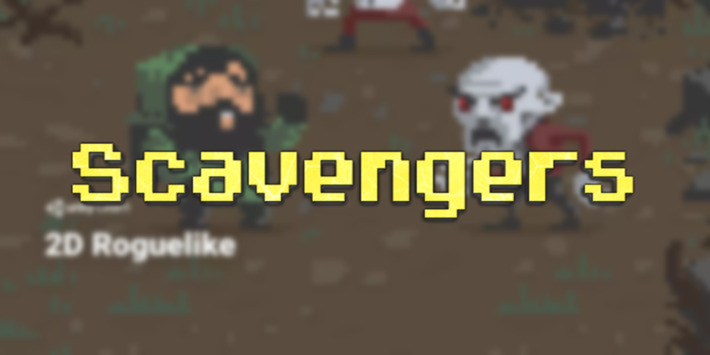

## Play Now!

Or watch a playthrough [here](https://www.youtube.com/watch?v=fooLFTT1zDQ)!

## A 2D Roguelike Experience

Complete with procedural tile-based levels, turn-based movement, hunger mechanics, and an old-school style.

### Every day is a struggle to survive. 

Use WASD / arrow keys to manuever a lone adventurer as he journeys through a long and dangerous dungeon. Goblins await, ready to pounce, but food and drinks replenish our brave hero.

### Each level is its own puzzle.

No two levels are alike, thanks to the magic of procedural generation. Devise clever paths (or forge new ones) that acquire food, evade foes, and lead you to the escape — but be sure not to burn your hunger bar in the process!

### A single move can seal your fate.

The global highscore is **67 days**, achieved by yours truly. Submit your own scores [here](https://github.com/KartikChugh/Scavengers/issues/new)! Just set the title to your score, attach a photo, and hit submit.

#### Leaderboard
Score|Name
---|---
67|kc
49|eric
33|michael
26|brian
25|clara
23|fady
20|cam

## More Info

### Powered by Unity

Made in Unity 5 with the help of a [Unity Learn tutorial](https://learn.unity.com/project/2d-roguelike-tutorial) and custom tweaks to mechanics/audio.

### Maze Venturer

A [maze-based variant](https://simmer.io/@kc7/maze-venturer/) of Scavengers was nominated for the **Simmer.io Founder's Club**. You have a greater number of possible paths to take, but surviving is significantly more challenging as each move must be rationed carefully.
