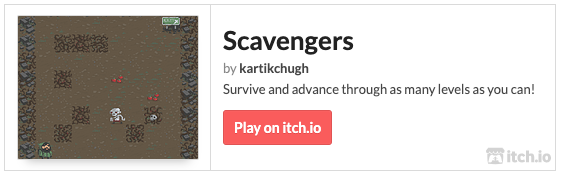
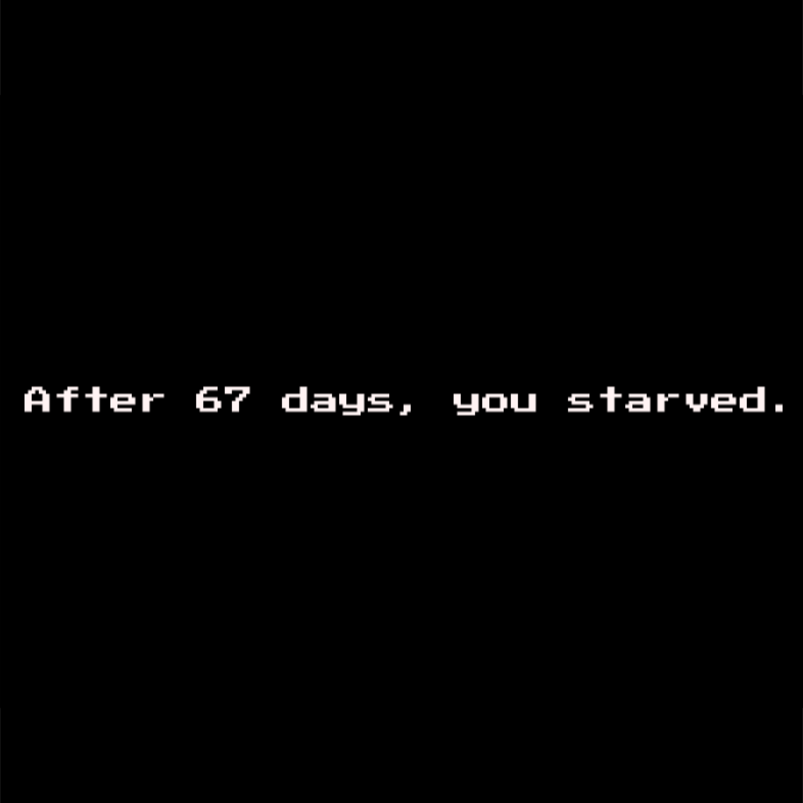

## Play Now!

## A 2D Roguelike Experience

Complete with procedural tile-based levels, turn-based movement, hunger mechanics, and event-driven audio!

### Every day is a struggle to survive. 

Use WASD / arrow keys to manuever a lone adventurer, **Halen**, as he journeys through a long and dangerous dungeon. 
  Goblins await, ready to pounce, but food and drinks replenish our brave hero.

### A new level is its own puzzle.

No two levels are alike, thanks to the magic of procedural generation. 
  Devise clever paths (or forge new ones) that acquire food and evade foes — but be sure not to burn your hunger bar in the process!

### Each move can bring you away from, or closer to death.

The global highscore is **56 days**, achieved by yours truly. Submit your own scores [here](https://github.com/KartikChugh/Scavengers/issues/new)! Just set the title to your score, attach a photo, and hit submit.

#### Highscores
Score|Name
---|---
56|kc
33|michael
27|kc

## Powered By Unity

Made in Unity 5 with public assets, textures, and audio.
